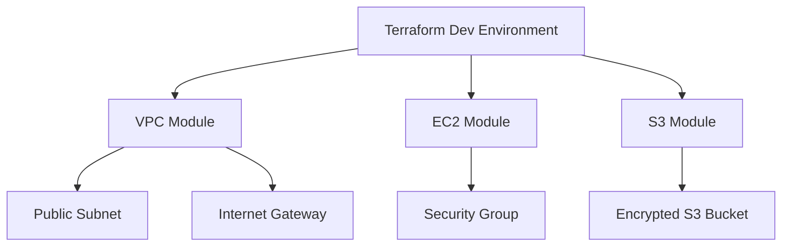

# AWS Terraform Infrastructure

A production-style Terraform project for provisioning core AWS infrastructure using reusable modules and an environment-based folder structure.

This repository is designed as a DevOps portfolio project to demonstrate practical knowledge of AWS infrastructure provisioning, Terraform modules, security groups, tagging standards, and deployment workflow.

## Tech Stack

| Area | Tools / Services |
|---|---|
| Cloud | AWS |
| Infrastructure as Code | Terraform |
| Compute | EC2 |
| Networking | VPC, Subnet, Internet Gateway, Route Table, Security Group |
| Storage | S3 with versioning, encryption, and public access block |
| Environment | Dev-ready structure with reusable modules |

## What This Project Demonstrates

- Modular Terraform structure for reusable AWS resources
- VPC creation with public subnet and routing
- EC2 provisioning with controlled inbound access
- S3 bucket with encryption, versioning, and public access protection
- Environment-specific deployment from `envs/dev`
- Practical tagging and variable-driven configuration
- Clean structure suitable for multi-environment expansion

## Architecture Overview



## Repository Structure

```text
.
├── envs/
│   └── dev/
│       ├── main.tf
│       ├── variables.tf
│       └── terraform.tfvars.example
├── modules/
│   ├── vpc/
│   ├── ec2/
│   └── s3/
├── docs/
│   └── deployment-steps.md
└── README.md
```

## How To Use

Clone the repository:

```bash
git clone https://github.com/sandeshpt/aws-terraform-infra.git
cd aws-terraform-infra/envs/dev
```

Copy the sample variable file:

```bash
cp terraform.tfvars.example terraform.tfvars
```

Update values such as AMI ID, SSH CIDR, and S3 bucket name, then run:

```bash
terraform init
terraform fmt -recursive
terraform validate
terraform plan
terraform apply
```

## Important Notes

- Do not allow SSH from `0.0.0.0/0` in real environments.
- Use remote backend with S3 and DynamoDB locking for team usage.
- Use IAM roles and least-privilege access in production.
- Review cost impact before applying resources in an AWS account.

## Possible Production Improvements

- Add private subnets and NAT Gateway
- Add Application Load Balancer
- Add Auto Scaling Group or Launch Template
- Add RDS module with subnet group and security group rules
- Add Terraform backend configuration
- Add CI validation using GitHub Actions or Jenkins
- Add security scanning using Checkov or tfsec

## Interview Talking Points

This project can be used to explain:

- Why Terraform modules are useful in DevOps projects
- How environment-wise infrastructure can be organized
- How security groups control traffic to EC2
- How S3 versioning and encryption improve data protection
- How Terraform plan/apply workflow helps reduce deployment risk
- How the structure can be extended for dev, stage, and prod accounts

## Author

**Sandesh Prabhakar T**  
Senior DevOps Engineer | AWS | Terraform | Kubernetes | Jenkins | Linux
